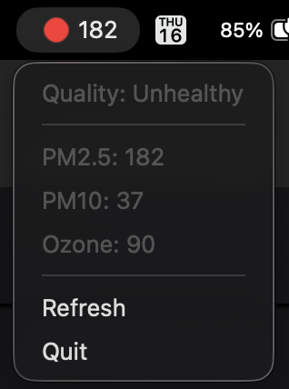

# MAQI

### Menubar Air Quality Index


A helpful little mac OS menu bar app for fetching the current air quality index (AQI) for your ZIP code from [airnow.gov](https://www.airnow.gov).

The displayed AQI is the highest value from among three tracked pollutants:
- **PM2.5** &mdash; fine particulate matter of 2.5 µm or smaller
- **PM10** &mdash; coarse particulate matter of 10µm or smaller
- **Ozone** &mdash; a gas formed from chemical reactions involving sunlight and pollutants, a.k.a **O3**

The index values for all three of these pollutants is shown in the main menu.

### Changes:
**v0.1.0** - Initial release


## Screenshots


## Environment Variables
This application expects a `.env` file at the project root. Your `.env` must contain the following keys:
```ini
# Required
AIRNOW_API_KEY = <your API key here>
ZIP_CODE = <your zip code here>
# Optional
REFRESH_INTERVAL_SECONDS = <default is 3600>
```
***You will need to create this file if it does not exist.***


## Dependencies
  - [httpx](https://github.com/encode/httpx)
  - [py2app](https://py2app.readthedocs.io/en/latest/index.html)
  - [rumps](https://github.com/jaredks/rumps?tab=readme-ov-file)
  - [python-dotenv](https://github.com/theskumar/python-dotenv)

  ##

> [!WARNING]
> MAQI is for informational use only. Air quality values may be delayed, incomplete, or unavailable, and should not be used as medical or emergency guidance. Always follow local health advisories and consult a qualified professional for medical decisions.
